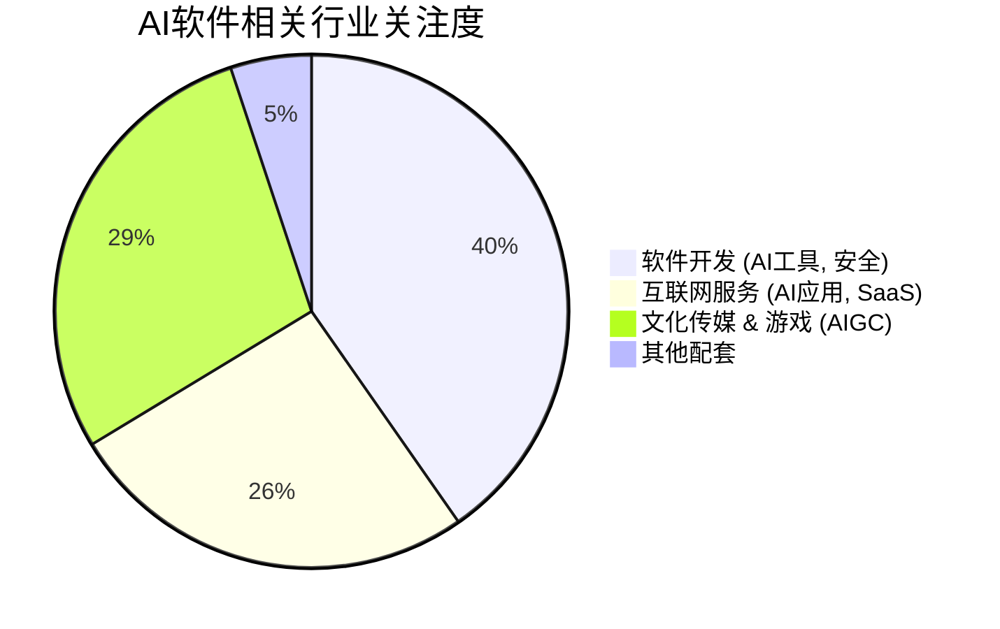

## 1. 核心投资逻辑

2025-2026年是 AI 软件从“能力博弈”转向“应用落地”与“生态重构”的关键阶段。

1. **AI Agent (智能人/智能体) 的崛起**:

- **逻辑**: AI 不再仅仅是对话框，而是能够自主规划、调用工具并执行任务的 Agent。

- **受益领域**: 办公协作、创意设计（万兴科技、福昕软件）、企业 ERP（用友网络）。

- **驱动力**: DeepSeek 等高性能、低成本开源模型的普及，大幅降低了企业部署 AI Agent 的门槛。

2. **AI 安全与治理 (AI Security)**:

- **逻辑**: 随着 AI 大规模进入生成和生产环节，内容合规、模型安全、数据保护成为刚需。

- **受益个股**: 安恒信息、启明星辰、奇安信。2026年业绩修复预期极强（>80%）。

3. **垂直赛道赋能 (Vertical AI)**:

- **AI + 金融**: 同花顺、东方财富利用 AI 提升投顾和交易效率。

- **AI + 营销**: 蓝色光标、利欧股份。利用 AIGC 实现内容大量产，降低营销成本。

## 2. 重点个股分析

代码 | 名称 | 行业 | 2026E 增长率 | 投资看点 |
:--- | :--- | :--- | :--- | :--- |
300624 | 万兴科技 | 软件开发 | 613% | 创意软件龙头，深度集成 AIGC 功能，业绩爆发力强 |
688023 | 安恒信息 | 软件开发 | 283% | 网络安全专家，受益于 AI 基础设施安全保护需求 |
002439 | 启明星辰 | 软件开发 | 240% | 移动与 AI 赋能下的安全龙头，业绩高增长弹性 |
600588 | 用友网络 | 软件开发 | 156% | 企业 B 端应用 AI 化，订阅模式升级带动估值中枢提升 |
688095 | 福昕软件 | 软件开发 | 106% | PDF 智能助手先行者，全球化 AI Agent 落地 |
002230 | 科大讯飞 | 软件开发 | 38% | 国产大模型先行者，教育、医疗等垂直领域壁垒深厚 |
300033 | 同花顺 | 软件开发 | 24% | 证券 IT 与 AI 的深度结合，盈利能力稳健 |

## 3. 行业发展趋势分布

从 profit2025.csv 覆盖的个股来看，软件开发 and 互联网服务是 AI 渗透率最高的区域。

## 4. 总结与投资策略

- **激进型**: 布局 **AI Agent 概念**（万兴科技、福昕软件）以及 **AI 安全**（安恒、启明）。

- **稳健型**: 布局 **AI + 垂直细分龙头**（同花顺、科大讯飞）。

- **风险提示**: 落地进度不及预期、地缘技术封锁风险。