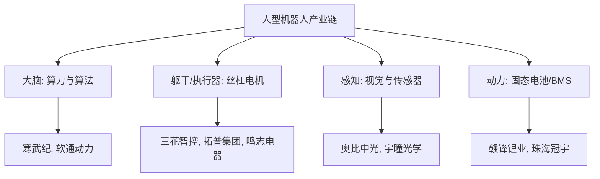

## 1. 核心投资逻辑

2025-2026年是人型机器人从“实验室原型”迈向“工厂实训”与“商业化元年”的历史转折点。

1. **2026 商业化元年 (Commercialization Year 1)**:

- **逻辑**: 特斯拉 Optimus 计划于 2026 年量产（目标 5-10 万台）。同时，国内如智元、宇树等头部厂商已开启小规模出货。

- **受益点**: 整机组装、核心执行器（拓普集团、三花智控）。

2. **具身智能 (Embodied AI) 的大脑突破**:

- **逻辑**: 2025 年多项政策支持建立机器人数据采集中心，解决了 AI 驱动机器人互动的“数据荒”。

- **受益点**: AI 算力芯片（寒武纪）、机器视觉（奥比中光）、“大脑+小脑”控制器（智微智能）。

3. **核心零部件的“中坚力量”**:

- **逻辑**: 执行器占总成本 50% 以上，包括行星滚柱丝杠、精密减速器和高功率密度电机。

- **受益点**: 精密电机（鸣志电器）、减速器（绿的谐波）、丝杠配套。

4. **能源底座升级**:

- **逻辑**: 移动机器人对长续航、高安全性的要求推动了固态电池和高倍率电池应用。

- **受益点**: 赣锋锂业（机器人固态电池布局）、珠海冠宇。

## 2. 重点个股分析 (基于 profit2025.csv 2026E 增长预测)

筛选 2026E EPS 增长率，发现具备“算法反转”或“能源反转”逻辑的标的业绩弹性最高。

| 代码     | 名称   | 行业    | 2026E 增长率 | 投资看点                           |
| :----- | :--- | :---- | :-------- | :----------------------------- |
| 002527 | 新时达  | 专用设备  | 591%      | 国内工业机器人控制系统领先者，2026年业绩反转预期强劲   |
| 002460 | 赣锋锂业 | 能源金属  | 490%      | 提供机器人所需的高能量密度/固态电池，周期反转与新兴赛道共振 |
| 688256 | 寒武纪  | 半导体   | 125%      | 具身智能终端 AI 算力底座，国内极其稀缺的“大脑”芯片标的 |
| 688322 | 奥比中光 | 电子元件  | 115%      | 机器人的“眼睛”，3D 视觉感知龙头，已切入多家头部整机厂  |
| 603728 | 鸣志电器 | 电机    | 44.5%     | 全球一流的高精度微电机供应商，执行器核心配套         |
| 001339 | 智微智能 | 计算机设备 | 44.9%     | 开源鸿蒙/具身智能“大小脑”控制器，业绩稳健增长       |
| 601689 | 拓普集团 | 汽车零部件 | 24.2%     | 特斯拉 Optimus 核心供应商，具备大规模工业化量产能力 |

## 3. 产业链架构分布

人型机器人正形成“一脑、两耳、两眼、四肢”的产业链格局。

## 4. 总结与投资策略

- **激进型 (追逐高弹性)**: 关注 **具身智能大脑 (寒武纪)** 与 **视觉感知 (奥比中光)**，虽然估值波动大，但想象空间极高。

- **稳健型 (蓝筹配置)**: 关注 **特斯拉产业链标杆 (拓普集团、三花智控)**。随着 Optimus 量产，业绩确定性最高。

- **风险提示**: Optimus 量产进度不及预期；AI 大模型在物理世界的泛化能力瓶颈；地缘政治对芯片供应的影响。