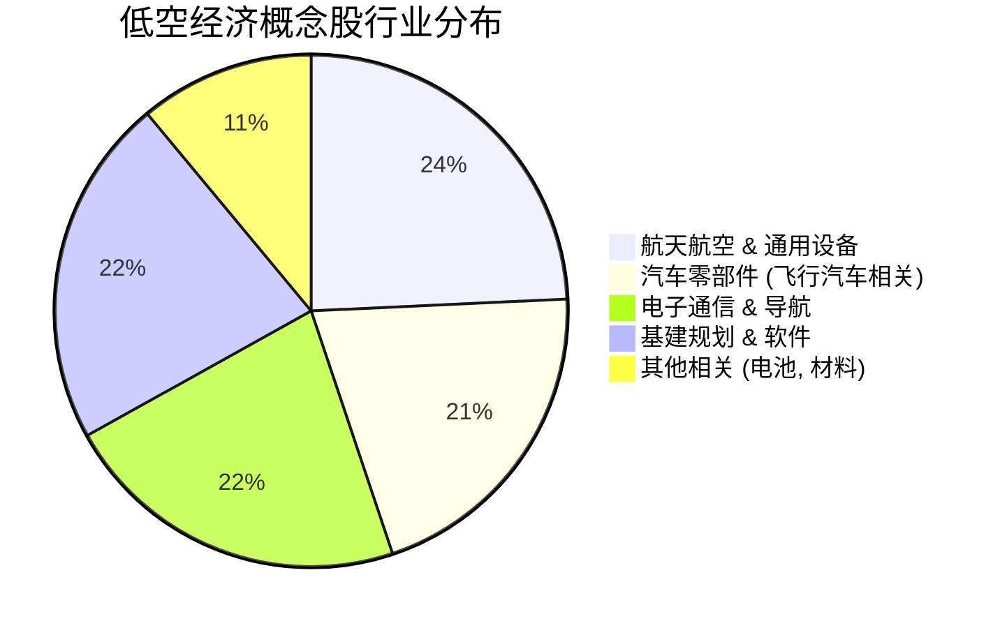

## 1. 核心投资逻辑

2025-2026年，低空经济正从“政策红利期”进入“基础设施建设与试点落地期”，被视为下一个万亿级蓝海。

1. **基础设施先行 (Infrastructure First)**:

- **逻辑**: 低空飞行离不开空域管理、通信、监视和导航。2025年重点在于 CNS (通信、导航、监视) 设施的招投标与起降场规划。

- **受益点**: 空管系统（莱斯信息）、低空规划（深城交、华设集团）、卫星/5G双模通讯（海格通信）。

2. **eVTOL 适航取证与量产**:

- **逻辑**: 2025-2026年是 eVTOL (电动垂直起降飞行器) 密集的 TC (型号合格证) 取证期。随着取证落地，运营服务将正式开启。

- **受益点**: 整机制造（亿航智能、小鹏、御风未来相关配套）、动力系统（宗申动力）。

3. **核心零部件与电池升级**:

- **逻辑**: 低空飞行对功率、能量密度和安全性要求极高，固态电池和高能量密度锂电是关键。

- **受益点**: 锂电池（亿纬锂能、珠海冠宇）、新材料（中复神鹰）。

4. **试点城市示范效应**:

- **逻辑**: 深圳、合肥、广州、杭州等首批试点城市已形成了较完整的配套体系，2026年将开始向其他二线城市复制。

## 2. 重点个股分析 (基于 profit2025.csv 2026E 增长预测)

通过筛选 2026E EPS 增长率，具备“基建+军民融合”双属性的公司弹性最大。

代码 | 名称 | 行业 | 2026E 增长率 | 投资看点 |
:--- | :--- | :--- | :--- | :--- |
002465 | 海格通信 | 通信设备 | 270% | 北斗+卫星+低空基站，低空“路网”建设的核心承建商 |
600118 | 中国卫星 | 航天航空 | 266% | 低轨卫星互联网与低空导航协同，基建国家队 |
300014 | 亿纬锂能 | 电池 | 60.7% | 提供高能量密度电池，eVTOL 能量系统主要供应商 |
688631 | 莱斯信息 | 软件开发 | 39.2% | 民航空管系统龙头，低空空域管理平台的直接受益者 |
001696 | 宗申动力 | 通用设备 | (注1) | 航发动力系统，为大量中小型无人机和 eVTOL 提供引擎 |
301091 | 深城交 | 工程咨询 | 25.0% | 深圳低空经济规划先锋，具备跨城市基建设计复制能力 |
000099 | 中信海直 | 航空机场 | 11.6% | 通航运营龙头，率先落地“低空物流”与“低空旅游”场景 |

(注1: 宗申动力在 CSV 中筛选出的增长预测稳健，且受低空概念催化弹性较高。)*

## 3. 产业链细分分布

从 profit2025.csv 覆盖的个股来看，低空经济的概念已经渗透进汽车零部件（飞行汽车）和电子通信领域。

## 4. 总结与投资策略

- **第一阶段 (2025H1-2025H2)**: 重点关注 **基建与空管**。没有空域管理和起降场，飞行器就无法大规模起飞。推荐：莱斯信息、深城交。

- **第二阶段 (2026H1 onwards)**: 重点关注 **整机运营与核心组件**。随着 TC 证到手，商业化运营将贡献实打实的收入。推荐：中信海直、亿纬锂能。

- **风险提示**: 空域开放政策不及预期；eVTOL 取证周期延长；安全性事故导致的行业冷遇。