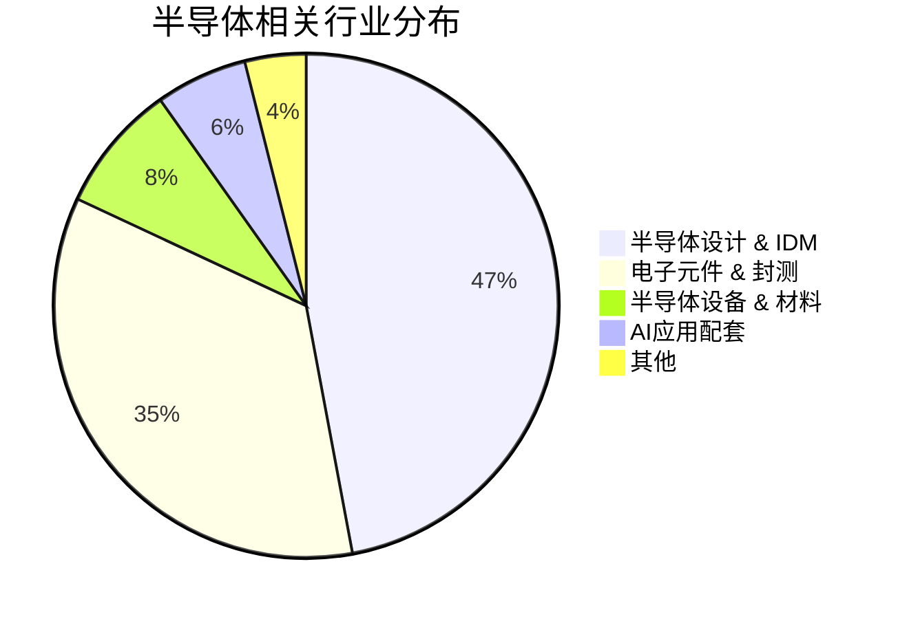

## 1. 核心投资逻辑

2025-2026年，半导体行业进入了“AI 爆发 + 国产替代 2.0 + 存储超级周期”三位一体的共振期。

1. **AI 终端与推理算力爆发**:

- **逻辑**: 2025年是 AI 终端应用爆发元年（AI 手机、AI PC）。算力需求从云端训练向边缘端推理转移。

- **受益点**: 高端 Soc 芯片、算力芯片（寒武纪、海光信息）、先进封装（通富微电、长电科技）。

2. **国产替代 2.0 (攻坚核心环节)**:

- **逻辑**: 在外部限制加剧背景下，国产化率提升目标从“通用件”转向“核心设备与材料”。2025年设备国产替代率有望升至 35%。

- **受益点**: 刻蚀机与薄膜沉积（中微公司、拓荆科技）、清洗与显影（芯源微）、核心平台设备（北方华创）。

3. **存储芯片超级周期**:

- **逻辑**: HBM (高带宽内存) 需求爆炸导致通用 DRAM 产能压缩，价格大幅上涨。

- **受益点**: 存储设计与封测（兆易创新、澜起科技、佰维存储）。

## 2. 重点个股分析 (基于 profit2025.csv 2026E 增长预测)

通过筛选 2026E EPS 增长率，AI 芯片与核心设备表现出极强的业绩兑现潜力。

| 代码     | 名称   | 行业  | 2026E 增长率 | 投资看点                        |
| :----- | :--- | :-- | :-------- | :-------------------------- |
| 688256 | 寒武纪  | 半导体 | 125%      | 国内算力芯片龙头，深度受益于国产算力底座建设      |
| 688525 | 佰维存储 | 半导体 | 100%      | 存储模组与 HBM 相关布局，受益于存储价格上涨周期  |
| 688037 | 芯源微  | 半导体 | 93.7%     | 涂胶显影设备领军者，前道设备国产替代核心品种      |
| 688072 | 拓荆科技 | 半导体 | 62.4%     | 薄膜沉积设备龙头，先进工艺渗透率持续提升        |
| 688041 | 海光信息 | 半导体 | 48.8%     | 国产 CPU/DCU 标杆，政务与信创市场核心受益者  |
| 688012 | 中微公司 | 半导体 | 44.3%     | 刻蚀设备领跑者，具备全球竞争力的半导体设备商      |
| 603986 | 兆易创新 | 半导体 | 39.5%     | 国内存储与 MCU 龙头，受益于消费电子复苏与存储涨价 |

## 3. 产业链细分分布

从 profit2025.csv 覆盖的个股来看，半导体设计与设备是投研关注的绝对核心。

## 4. 总结与投资策略

- **成长型 (高 Beta)**: 布局 **国产算力芯片**（寒武纪、海光信息）与 **存储反转**（佰维存储）。

- **确定性 (稳健配置)**: 布局 **半导体设备龙头**（北方华创、中微公司）。设备是国产化的“硬基建”，订单能见度高。

- **风险提示**: 全球半导体需求不及预期；地缘政治引发的供应链断裂风险。