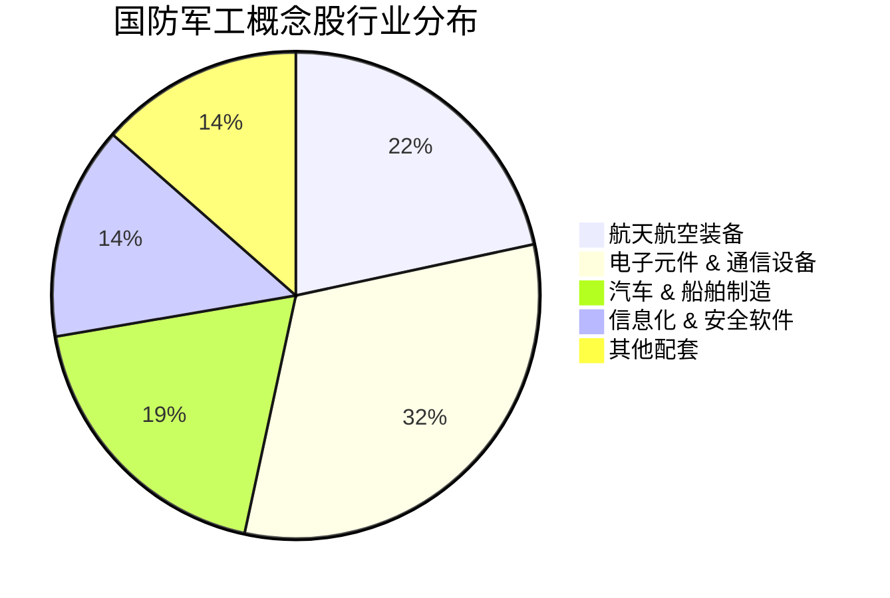

## 1. 核心投资逻辑

2025-2026年，国防军工行业正处于“十四五”末期订单释放与“新质生产力”新兴赛道爆发的双重驱动期。

1. **“十四五”收官与“十五五”开启**:

- **补缺与放量**: 随着前期制约因素消除，2025年订单预计集中下发。主战装备（歼-20/35、航发）进入产能爬坡期。

- **中航沈飞、航发动力**等主机厂业绩预期稳健。

2. **低空经济 (Low-Altitude Economy)**:

- **万亿市场**: 政策支持下，无人机、eVTOL 成为增长最迅猛的细分领域。

- **受益点**: 轻量化材料（中复神鹰）、低空基站与通信（海格通信）、整机制造。

3. **卫星互联网与商业航天**:

- **星座布局**: GW 与“千帆计划”进入密集发射期。

- **受益点**: 卫星制造（中国卫星）、卫星通信收发模组及北斗导航（华测导航、中海达）。

4. **军贸外销**:

- **体系化出口**: 中国武器装备（无人机、远程火箭炮）在国际市场竞争力提升，军贸正成为第二增长曲线。

## 2. 重点个股分析 (基于 profit2025.csv 2026E 增长预测)

通过筛选 2026E EPS 增长率，卫星互联网与低空相关品种表现出极高的修复弹性。

代码 | 名称 | 行业 | 2026E 增长率 | 投资看点 |
:--- | :--- | :--- | :--- | :--- |
002465 | 海格通信 | 通信设备 | 270% | 卫星通信+北斗导航+低空基站，多重趋势叠加 |
600118 | 中国卫星 | 航天航空 | 266% | 卫星制造国家队，低轨星座建设核心受益者 |
600893 | 航发动力 | 航天航空 | 40.8% | 航空发动机龙头，新一代型号进入批产期 |
600879 | 航天电子 | 航天航空 | 37% | 商业航天、无人机核心配套商 |
002439 | 启明星辰 | 软件开发 | 240% (AI/安全) | 军工信息化安全与 AI 赋能，业绩高弹性 |
600482 | 中国动力 | 船舶制造 | 49.8% | 船舶动力系统龙头，受益于海军装备建设大周期 |
603712 | 七一二 | 通信设备 | 4533% (扭亏) | 军用无线通信龙头，2026年业绩有望迎来基数扭转 |
## 3. 产业链细分分布

从 profit2025.csv 覆盖的个股来看，航天航空装备和电子精密配套是军工的核心构成。

## 4. 总结与投资策略

- **成长型**: 掘金 **低空经济** 与 **卫星互联网** 产业链（海格通信、航天电子）。

- **稳健型**: 关注 **航空主机厂**（中航沈飞、中航西飞、航发动力）。

- **风险提示**: 武器装备研制进度、订单下放节奏不及预期；全球供应链波动对零部件的影响。