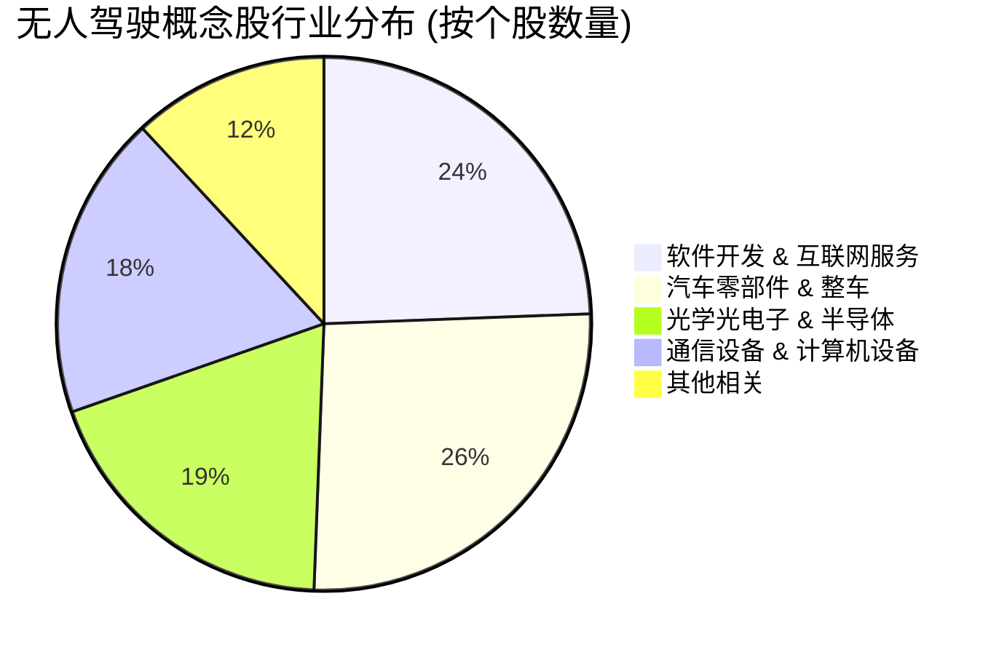

## 1. 核心投资逻辑

2025-2026年是无人驾驶从“单车智能”向“车路云一体化”跨越的关键期。

1. **车路云一体化 (V2X)**:

- **中国方案**: 通过“聪明的车 + 智慧的路 + 融合的云”协同，解决单车智能的长尾挑战。

- **基础设施先行**: 路侧感知设备、边缘计算和 5G 通信网络是2025年的建设重点。涉及公司如海康威视、工业富联。

2. **L3级自动驾驶商业化准入**:

- 2024年底至2025年初，L3级准入试点名单落地。2026年有望成为 L3 级量产爆发的元年。

- 核心受益点：域控制器（德赛西威）、线控底盘（伯特利）、智能传感器（豪威集团）。

3. **大模型在自动驾驶中的应用**:

- 视觉语言模型（VLM）和端到端自动驾驶技术的应用，大幅提升了在极端场景下的处理能力。

- 算力芯片和云端训练需求持续增长（工业富联、科大讯飞）。

## 2. 重点个股分析 (基于 profit2025.csv 预测)

通过对 2026E EPS 增长率的筛选，特定领域的配套商表现出极高的成长潜力。

代码 | 名称 | 行业 | 2026E 增长率 | 自动驾驶投资看点 |
:--- | :--- | :--- | :--- | :--- |
688007 | 光峰科技 | 消费电子 | 1300% | 激光雷达核心组件及车载显示，2026年有望放量 |
688326 | 经纬恒润 | 汽车零部件 | 622% | 电子电气架构与域控制器，受益于 L3 准入 |
600418 | 江淮汽车 | 汽车整车 | 506% (转型) | 与华为深度合作，智选车模式下的估值修复 |
601138 | 工业富联 | 消费电子 | 69% | AI 算力底座，车路云“融合云”端的核心受益者 |
601127 | 赛力斯 | 汽车整车 | 36% | 华为智驾模式领军者，L3 准入先行者 |
603501 | 豪威集团 | 半导体 | 29% | 汽车 CIS (图像传感器) 龙头，单车传感器价值量提升 |
002920 | 德赛西威 | 汽车零部件 | 25% | 智能座舱与智驾域控龙头，L3 产业化直接受益者 |

## 3. 产业链细分分布

从 profit2025.csv 的行业分类来看，软件开发和汽车零部件是无人驾驶的两大核心支柱。

## 4. 总结与投资策略

- **短期博弈**: 关注 **车路云一体化** 的招投标进度。

- **中期布局**: 布局进入 L3 级准入试点的整车及核心域控供应商（如德赛西威、华阳集团）。

- **长期愿景**: AI 大模型推动的 L4 级特定场景应用（如 Robotaxi）。

**风险提示**: 政策审批进度不及预期；自动驾驶安全事故对行业的短期冲击。