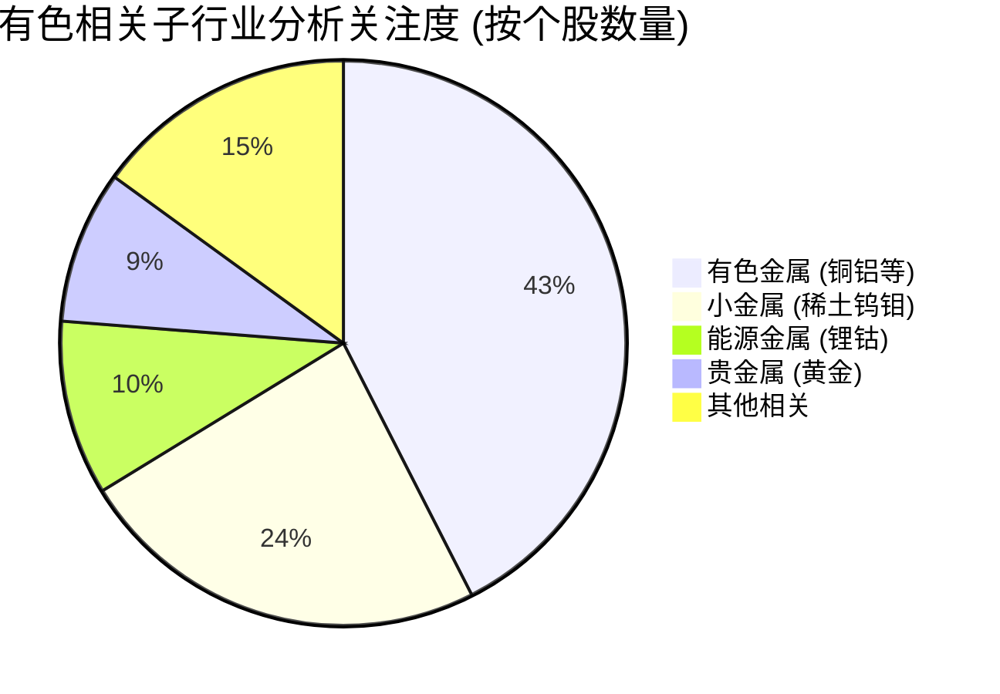

## 1. 宏观背景与核心逻辑

2024-2025年有色金属板块进入了“金、铜、锂”三位一体的复杂投资节奏，其核心逻辑受以下三大驱动力影响：

1. **宏观流动性与美元周期**:

- 随着美联储开启降息周期，美元指数下行，以美元计价的大宗商品（黄金、铜）获得直观的估值提升。

- “去美元化”背景下，全球央行持续增持黄金，黄金的货币属性和避险属性双重共振。

2. **铜：AI 与绿电引发的供给刚性缺口**:

- **AI 数据中心**: 数据中心对电力基础设施的建设直接拉动了铜需求（线缆、配电设备）。

- **供给端限制**: 全球铜矿品位下降，新项目周期长，导致铜价易涨难跌。紫金矿业作为国内铜矿龙头，利润弹性高度依赖铜价。

3. **锂：过剩周期的“磨底”与反弹**:

- 2024年锂价经历了单边下跌，2025年行业处于去产能和寻找底部的阶段。

- **博弈逻辑**: 2026年业绩修复。数据预测显示，锂矿公司（天齐锂业、赣锋锂业）在2026年有极高的 EPS 修复预期。

## 2. 重点个股分析 (基于 profit2025.csv 预测)

通过对 2026E EPS 增长潜力的筛选，锂矿公司呈现出极强的“困境反转”特征，而龙头矿企保持稳健。

代码 | 名称 | 行业 | 2026E 增长率 | 投资看点 |
:--- | :--- | :--- | :--- | :--- |
002460 | 赣锋锂业 | 能源金属 | 489% | 锂领军企业，2026年业绩有望随周期反转大幅修复 |
002738 | 中矿资源 | 能源金属 | 147% | 锂矿自有率高，成本优势显著 |
002466 | 天齐锂业 | 能源金属 | 120% | 全球优质锂矿持有人，高弹性品种 |
600111 | 北方稀土 | 小金属 | 36% | 稀土龙头，受益于机器人和风电永磁需求增长 |
603799 | 华友钴业 | 能源金属 | 32% | 低成本锂电材料龙头，印尼镍资源布局进入收获期 |
601899 | 紫金矿业 | 有色金属 | 23.6% | 全球金属矿业巨人，金、铜产量持续爬坡 |
603993 | 洛阳钼业 | 小金属 | 22.6% | 铜、钴增量全球第一，受 AI 数据中心建设带动力 |

## 3. 细分赛道分布

从 profit2025.csv 中有色相关的行业分布看，研究员关注度最高的是有色金属综合、小金属和能源金属。

## 4. 总结

- **进攻型**: 关注 **能源金属 (锂)**，博弈2026年行业周期反转和储能需求的超预期。

- **配置型**: 关注 **紫金矿业** 和 **北方稀土**。黄金提供了安全边际，铜和稀土提供了成长空间（AI 基础设施 + 机器人）。

- **风险提示**: 重点观察美元指数走势及全球地缘政治局势的波动。